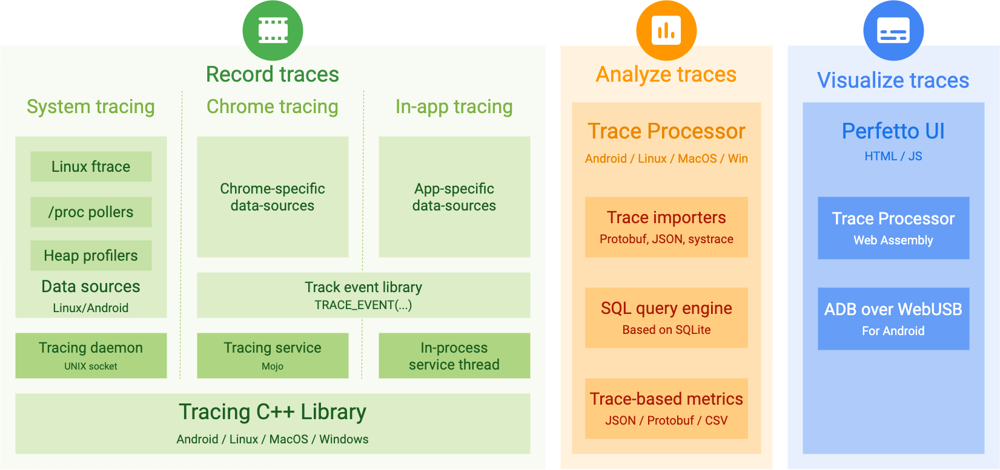
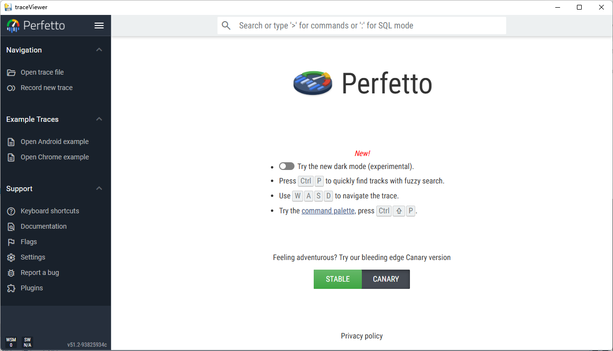

# traceViewer - windows for Perfetto
## Perfetto - System profiling, app tracing and trace analysis

Perfetto is an open-source suite of SDKs, daemons and tools which use
**tracing** to help developers understand the behaviour of complex systems and
root-cause functional and performance issues on client and embedded systems.

It is a production-grade tool that is the default tracing system for the
**Android operating system** and the **Chromium browser**.

## Perfetto UI
But there is no useful executable program for **windows**, you can visit **Perfetto UI** to view and analyze traces in the browser, provided there is an internet access https://ui.perfetto.dev/ 

## traceViewer
Now we can use **traceViewer** to view and analyze traces same as **Perfetto UI**, you can use **traceViewer** as it's **Perfetto UI**, because it's built from perfetto same as **Perfetto UI**.

## How to use **traceViewer**
reference to https://perfetto.dev/docs/visualization/perfetto-ui

## release log:

**perfetto_win32-x64_v51.2.tar.gz**:
source:
https://github.com/google/perfetto/tree/v51.2

perfetto_amd64:
https://github.com/google/perfetto/releases/tag/v51.2

